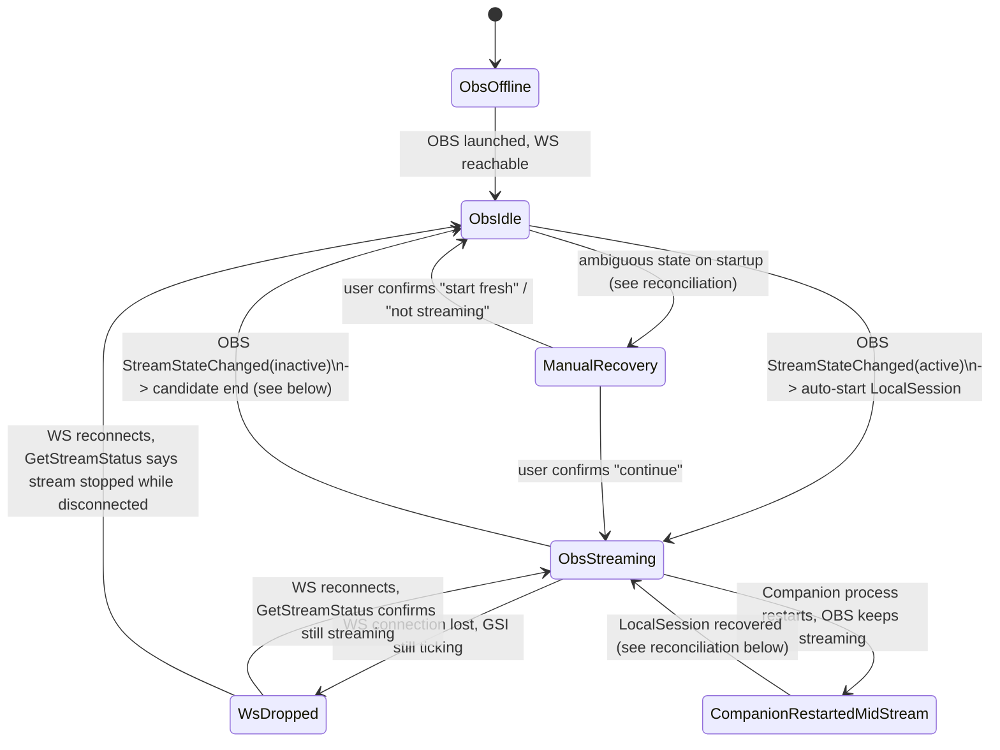

# WK-110: Local-first audit and target architecture for Companion

## Question

Companion (Tauri desktop app) grew up around the `prereborn.ru` backend (`apps/api`) as part of
its hot path — GSI forwarding, session lifecycle, matches, MMR/corrections — even where a
feature has no technical need for network access. WK-108/WK-109 proved Custom Game Sounds is
already fully local and backend-independent, with a regression test
(`playback_resolution_never_depends_on_backend_state`) pinning that boundary. Every other
feature was unaudited.

This document answers, for every Companion feature, with citations to the code as it exists on
disk today (not task descriptions, not naming, not assumptions):

- what the **current** source of truth (SoT) is,
- what **actually** calls the backend (verified by reading the call sites),
- what breaks without the backend and what survives a Companion restart,
- what the **target** SoT should be under a local-first design,
- what needs to keep syncing to the backend and why.

This is a research/architecture task. **No implementation, no migrations, no production
behavior change, no merge/release/deploy happens in this ticket.** The output is this document,
used to scope WK-111 (local durable state), WK-112 (OBS-driven lifecycle), WK-113 (backend
sync), and to inform WK-114 (Old-Dota shell).

Per the project's `docs/research/README.md` convention this would normally be a short decision
record; this one is long because the ticket (P0, blocks a whole iteration) explicitly asks for a
14-part deliverable spanning eleven feature areas. Sections below map directly onto the ticket's
"Описание" checklist.

## Non-goals (explicit, per ticket)

- Not designing web (`apps/web`) as a future source of truth. Web/public overlay remain
  consumers of whatever Companion or the backend produce.
- Not local-first-ing the public browser overlay, auth/account, or a future Twitch Extension.
- Not implementing anything in this ticket — no local runtime, no OBS-driven lifecycle code, no
  sync/reconciliation code, no UI changes.

## Methodology and branch-state disclaimer

Audit performed against the working tree on branch `feat/wk-105-mmr-correction-model`. Two
things matter for reading the MMR section below:

1. `main` (local ref) is stale at `8711228` (before WK-105). `git diff main --stat` shows the
   real diff spans 17 files, ~1600 insertions, including `apps/api/src/db/migrate.ts` (+41),
   `stream-match-correction-service.ts` (+182), `stream-session-service.ts` (+89), the WK-105
   test file (+991 lines), and touches into `apps/web` overlay/panel components.
2. Within this branch, commit `b93996a` ("separate match-delta correction from absolute Current
   MMR correction") is **already committed**, but `git status` shows four files still modified
   in the working tree on top of it: `apps/api/src/controllers/stream/matches.ts`,
   `apps/api/src/controllers/stream/session.ts`,
   `apps/api/src/services/stream-match-correction-service.ts`, and the WK-105 test file. Some
   behavior described below (the ended-session correction guard, the diff-based session
   rewrite) exists only in this **uncommitted** working-tree state, not in `b93996a` itself.
   Each claim in §2 is flagged committed vs. uncommitted where it matters.

Custom Game Sounds (WK-106–109) does not exist on this branch or on local `main` — it lives on
`origin/main` (merge of `fix/wk-109-gsi-cadence-blood-grenade-last-charge`). Its citations in §2
are read via `git show origin/main:<path>` and are unaffected by the WK-105 branch.

---

# 1. Current architecture diagram

```mermaid
flowchart TB
    subgraph Dota["Dota 2 client"]
        GSICfg["gamestate_integration_dota_companion.cfg"]
    end

    subgraph Companion["Companion (Tauri desktop app)"]
        subgraph Rust["Rust core (src-tauri)"]
            GSIServer["Local GSI HTTP server\n127.0.0.1:3665\nserver/mod.rs"]
            AppState["AppState (in-memory)\nstate.rs"]
            OBSMod["obs.rs\nscene resolver + retry"]
            SoundsMod["game_sounds/*\n(origin/main only)"]
            Diag["diagnostics/*"]
            Silero["silero.rs\nlocal TTS sidecar"]
            BackendMod["backend/mod.rs\nHTTP client, 500ms send loop\n1s/3s pollers"]
            StorageMod["storage/mod.rs\ncompanion-config.json\nobs-config.json"]
            Hotkeys["hotkeys.rs\nhotkeys-config.json"]
        end
        subgraph FE["React frontend (webview)"]
            ChatUI["Twitch chat/TTS UI\nlocalStorage settings"]
            SettingsUI["Settings pages"]
            EventHist["eventHistory.ts\nlocalStorage ring buffer"]
            SessionAck["session-ack-storage.ts\nlocalStorage"]
        end
    end

    subgraph OBSApp["OBS Studio (local machine)"]
        OBSWS["obs-websocket v5\nws://127.0.0.1:4455"]
    end

    subgraph Backend["apps/api (prereborn.ru, Node/Express)"]
        CompanionRoutes["/api/stream/companion/*\n(6 routes, companion-token auth)"]
        AccountRoutes["/api/stream/account/*\n(web dashboard, JWT auth)"]
        OverlayRoutes["/api/stream/overlay/:publicToken"]
        IntegrationRoutes["/api/stream/integrations/*"]
        MatchSvc["stream-match-service.ts\nmatch state machine"]
        SessionSvc["stream-session-service.ts\nsession + MMR ledger"]
        CorrectionSvc["stream-match-correction-service.ts"]
        TwitchSvc["twitch-integration-service.ts\ntwitch-eventsub-chat.ts"]
        DB[("Postgres\nstream_sessions\nstream_matches\nstream_users")]
    end

    subgraph Twitch["Twitch"]
        TwitchEventSub["EventSub WebSocket\nchat/follow/sub/raid"]
    end

    subgraph Web["apps/web (Next.js)"]
        Dashboard["/stream dashboard (JWT)"]
        OverlayPage["/overlay/:publicToken\n(OBS Browser Source)"]
    end

    GSICfg -->|POST every ~tick| GSIServer
    GSIServer --> AppState
    AppState --> OBSMod
    AppState --> SoundsMod
    AppState --> Diag
    OBSMod <-->|local ws, request/response only| OBSWS
    SoundsMod -->|Tauri event| ChatUI
    AppState -->|500ms dirty-flag push| BackendMod
    BackendMod -->|PUT gsi-state| CompanionRoutes
    BackendMod -->|GET session (3s), GET commands (1s)| CompanionRoutes
    BackendMod -->|POST session/reset, session/end| CompanionRoutes
    BackendMod -->|GET twitch-chat (polled 1.5s by FE)| CompanionRoutes
    CompanionRoutes --> MatchSvc
    CompanionRoutes --> SessionSvc
    MatchSvc --> DB
    SessionSvc --> DB
    CorrectionSvc --> DB
    AccountRoutes --> CorrectionSvc
    AccountRoutes --> SessionSvc
    TwitchSvc <--> TwitchEventSub
    TwitchSvc --> CompanionRoutes
    IntegrationRoutes --> TwitchSvc
    OverlayRoutes --> DB
    OverlayRoutes --> TwitchSvc
    Dashboard --> AccountRoutes
    OverlayPage -->|poll 1.5s| OverlayRoutes
```

Key read from this diagram: everything left of "Backend" that stays inside the dashed
`Companion` box today is **already** local (GSI ingest, OBS scene automation from GSI, Game
Sounds, diagnostics, TTS synthesis, settings). Everything that crosses into `Backend` is where
the local-first migration has to make deliberate decisions.

---

# 2. Feature → current SoT → target SoT matrix

Legend for "Can be local": **Yes** (already is), **No** (inherently needs a shared/server-side
system), **Partial** (today it's backend-only but the logic itself doesn't need to be).

## 2.1 GSI ingest

| Sub-feature | Event source | Current SoT | Stored | Backend calls | Without backend | After restart | Can be local | Target SoT |
|---|---|---|---|---|---|---|---|---|
| Payload receipt | Dota POST to local `tiny_http` server, `127.0.0.1:3665` (`server/mod.rs:12-55`, port `state.rs:6`) | In-memory `AppState` (`last_gsi_payload`, `state.rs:109`) | In-memory only; `parse_payload` explicitly never touches disk (`storage/mod.rs:129-133`, test `parse_payload_never_touches_disk_even_under_heavy_load`) | None in the ingest path (verified: no `reqwest`/`http::`/`fetch` in `src/gsi/`, `src/server/`) | No effect — ingest is fully decoupled | Resets to defaults; rebuilt from next GSI tick | **Yes, already is** | Same — already correct |
| Current game state / hero/items/abilities | Same payload | In-memory `AppState` fields | In-memory | None | No effect | Resets, rebuilt from next tick | **Yes, already is** | Same |
| Reconnect/stale detection | Derived signal | `ConnectionState` (`gsi_state`), computed in `state.rs:144-159` from `server_running` + last-received timestamp | In-memory | None — pinned by test `missing_gsi_packets_alone_do_not_affect_backend_state` (`state.rs:290-303`) | No effect | Resets to `Unavailable`/`Waiting` until first post-restart tick | **Yes, already is** | Same |
| GSI config install/discovery | User action (`find_dota`/`install_gsi` Tauri commands) | Filesystem: `.cfg` written into the Dota install dir (`gsi/config.rs:63-74`) | On disk, in Dota's own directory | None | No effect | Re-detected each run via registry lookup (`gsi/finder.rs`) | **Yes, already is** | Same |
| GSI → backend forwarder | Same payload, dirty-flagged | `backend::try_send_pending`/`send_state` (`backend/mod.rs:159-195,380-410`), own 500ms-tick thread | N/A (transient push) | `PUT /stream/companion/gsi-state` | Retries with capped backoff; ingest itself unaffected | Forwarder restarts fresh | **Partial — this is the one seam to cut/gate** | Becomes a background async publisher off the local match/session state (see §5, §8), not a raw-payload relay |

## 2.2 Stream session lifecycle

| Sub-feature | Event source | Current SoT | Stored | Backend calls | Without backend | After restart | Can be local | Target SoT |
|---|---|---|---|---|---|---|---|---|
| Session creation (lazy, first-ever) | Any authenticated request when no `stream_sessions` row exists | `getOrCreateActiveSession` (`stream-session-service.ts:76-96`), unique partial index `idx_stream_sessions_one_active_per_user` | Postgres `stream_sessions` only — **no local Companion equivalent exists** (confirmed: `storage/mod.rs` only ever persisted `companion_token` + `obs-config.json`) | `GET /stream/companion/session` (`companion.ts:22-26`) | Fails entirely | Re-fetched from backend on next poll | **No, today** / target: local-first | Companion-generated local session id, reconciled to backend async |
| Active/ended read | Poll | `stream_sessions.ended_at` | Postgres | `GET /stream/companion/session`, polled every 3s (`SESSION_POLL_INTERVAL`, `backend/mod.rs:17`) | Companion's in-memory `session_ended` (`state.rs:132`) stays at its last known value (defaults `false` on restart) | Corrected within ≤3s of first successful poll | **Partial** — read side can be cached/eventually-consistent | Local mirror updated by local match-state machine, backend as async publish target |
| Start-new/reset (MMR carry-over) | User action, "Начать новый стрим" | `resetActiveSession` (`stream-session-service.ts:249-296`) — ends current row, inserts new row, copies `rating` forward from the active row or the most recently ended one | Postgres only | `POST /stream/companion/session/reset` (`backend/mod.rs:256`) | Fails entirely — no local number to fall back to | N/A (user action) | **No, today** — MMR carry-over is a backend read-then-insert with no local mirror at all | Companion should hold the last-known MMR locally and perform the carry-over itself, publishing the new session to backend |
| End stream | User action, "Завершить стрим" (WK-100) | `endActiveSession` (`stream-session-service.ts:303-314`), idempotent | Postgres only | `POST /stream/companion/session/end` (`backend/mod.rs:305`) | Fails entirely (comment `backend/mod.rs:277-281` confirms Companion never assumes success without backend confirmation) | N/A | **Partial** — decision should still ultimately reach backend (dashboard/overlay must reflect it), but the *local* OBS reaction is already immediate on success (`obs::handle_session_state(app, true)` called directly, `backend/mod.rs:282-298`), ahead of the next poll | Local end-of-session event drives local OBS instantly; backend sync happens async |
| Startup "continue previous stream?" prompt data | Companion startup | Same session fetch as above | Postgres | `GET /stream/companion/session` | Prompt can't render | Re-fetched | Same as "active/ended read" | Same |
| Startup prompt **acknowledgement** | User dismiss/confirm | `SessionAck{sessionId, sessionUpdatedAt, acknowledgedAt}` (`apps/companion/src/session/session-ack-storage.ts:1-21`) | Browser `localStorage` inside the webview | None | Fully functional (pure function over already-fetched data) | Persists across restarts | **Yes, already is** | Same — this is the one genuinely local-first sub-feature in this whole area today |
| OBS scenes: Draft/Gameplay/BetweenMatches | Local GSI tick | `BroadcastScene::from_gsi` (`obs.rs:112-126`), pure function of GSI JSON | In-memory | None (verified, `obs::handle_gsi` at `server/mod.rs:82`) | Fully offline-capable | Re-derives from next GSI tick | **Yes, already is** | Same |
| OBS scene: PostStream | Backend poll (`ended` flag) or local self-service end button | `session_ended` mirrored from backend (`state.rs:126-132`) | In-memory mirror of Postgres | `GET /stream/companion/session` (3s poll) | PostStream scene never auto-triggers | Resets to `false`, corrected in ≤3s | **No, today** — no local notion of "session ended" independent of the backend flag | Needs a local session-lifecycle source of truth (see §6) so PostStream doesn't require a live backend poll |
| Web-triggered "test scene" command | Web dashboard button, backend mailbox (`obs-scene-command-service.ts`, in-memory, non-persisted) | Backend in-memory queue | Backend process memory only (explicitly "temporary single-process command mailbox") | `GET /stream/companion/commands`, polled every 1s | Feature no-ops; GSI-driven automation unaffected | Mailbox is backend-side, unaffected by Companion restart | **No, and not meant to be** — inherently a cross-device remote-trigger feature from the web dashboard | Stays backend-mediated (class **C**-like), but the 1s poll cadence itself should not remain a permanent local hot-path cost — see §3 |

## 2.3 Matches

| Sub-feature | Event source | Current SoT | Stored | Backend calls | Without backend | After restart | Can be local | Target SoT |
|---|---|---|---|---|---|---|---|---|
| Match start/post-game/finalize state machine | Raw GSI ticks, forwarded as-is | `processGsiPayloadForMatch` (`stream-match-service.ts:744-902`), `findActiveMatch` re-derives current match from DB every tick (`stream-match-service.ts:313-323`, by design, to survive backend restarts) | Postgres `stream_matches` only. Companion's local `AppState.last_gsi_payload` is a single-tick send buffer, **not** a match history | `PUT /stream/companion/gsi-state` | **Fails outright — a match that starts and finishes entirely during a backend outage produces no `stream_matches` row at all.** Companion holds only the single latest tick, no queue/replay of missed ticks | Lossless *if the backend stayed up* — `resumeMatch` re-picks up via a 5-minute reconnect window (`stream-match-service.ts:394-416`) | **Partial — highest-value migration target.** The state machine is a pure function of the GSI stream Companion already receives locally; it does not need a backend round-trip to run correctly | Port the match-detection state machine to run locally (Rust or a local process), sync finalized matches to backend async, fire-and-forget, same shape as today's `gsi-state` push but carrying decisions, not raw payloads |
| Win/loss detection | GSI `map.win_team` vs `player.team_name` | `stream-match-service.ts:889-895` | Postgres | Same pipeline | Fails | N/A | Same as above | Same |
| Ranked/unranked classification | `stream_users.game_mode` toggle, read **once** at match creation (`resolveIsRanked`, `stream-match-service.ts:499-518`), never re-read at finalize | Postgres `stream_users.game_mode`; Companion never reads/sets this toggle | Postgres | Same pipeline | Fails | N/A | **Partial** — the rule is a one-column lookup, trivially mirrorable to Companion once per session start | Companion caches the toggle locally at session start; classification computed locally |
| Manual match correction (`needs_review` resolution) | Web dashboard PATCH only | `correctStreamMatch` (`stream-match-correction-service.ts:139-626`), transactional, cascades through the session's match tail | Postgres | `PATCH /api/stream/account/me/matches/:matchId` — **no Companion call site at all** | Fails; not a Companion feature | N/A | **No, and shouldn't be** — retroactive audit tool, not hot-path, not exercised by Companion | Stays backend-only (class **C**) |
| Recent Games / Last Match display | Web dashboard / overlay render | `getRecentMatches`/`getRecentFinalizedMatches` (`stream-match-service.ts:155-206`) | Postgres | Dashboard/overlay reads only | Fails for those consumers | N/A | **N/A to Companion** — Companion doesn't render match history at all today | If Companion ever needs this, it would consume the local match history the state machine above produces |

## 2.4 MMR / delta / corrections (WK-105)

| Sub-feature | Event source | Current SoT | Stored | Backend calls | Without backend | After restart | Can be local | Target SoT |
|---|---|---|---|---|---|---|---|---|
| Per-match rating chain (`rating_before`/`rating_delta`/`rating_after`, `detected_rating_delta`/`rating_delta_correction` split) | Auto-finalize sets `detected_rating_delta = rating_delta`, `rating_delta_correction = 0` (`stream-match-service.ts:587-597`); manual correction adjusts `rating_delta_correction` only | Postgres `stream_matches` columns, migration `migrate.ts:507-508` (committed in `b93996a`) | Postgres. **Not a ledger** for per-match fields — current split lives on the row itself, no history table of past edits | (via correction endpoint) | Fails | N/A | **No** — audit/correction tool, not Companion hot path | Stays backend-only; local match state machine (2.3) should still record its own `detected` delta locally before sync, so a later backend correction never needs to be reverse-engineered from a lossy sync |
| Absolute "Установить текущий MMR" correction (ledger) | Web dashboard PATCH | `applyAbsoluteRatingCorrection` (`stream-session-service.ts:174-223`) — writes `stream_sessions.rating` directly, accumulates diff into cumulative `stream_sessions.rating_adjustment` (migration `migrate.ts:536`, committed). Never touches `stream_matches` (test: "does not rewrite match history") | Postgres | `PATCH /api/stream/account/session` | Fails; web-only, no Companion call site | N/A | **No** | Stays backend-only |
| Ended-session correction guard (`MatchSessionEndedError`) | Web dashboard PATCH against a match whose session already ended | Rejects (409) any correction that would move `rating_delta`/`rating_after` on an ended session (rationale: comment `stream-match-correction-service.ts:107-126`) | Postgres, in-transaction check | (via correction endpoint) | Fails | N/A | **No** | Stays backend-only. **Uncommitted on this branch** — exists only in the current working tree, not in `b93996a` |
| Session-write diff fix (`contributionDifference`) | Same correction flow | Session `rating` write changed from an outright overwrite (`session.rating = tailRatingAfter`, the bug that shipped in `b93996a`) to a diff-based update that preserves any absolute adjustment applied after the edited match | Postgres | (via correction endpoint) | Fails | N/A | **No** | Stays backend-only. **Uncommitted** — the committed `b93996a` still has the overwrite bug; the fix is only in the working tree |
| MMR carry-over between sessions | `resetActiveSession` reads the active (or most recently ended) session's `rating` and copies it into the new row | Postgres — **MMR is account-scoped conceptually but physically stored per-session-row**, with no independent account-level "current MMR" column | Postgres | `POST /stream/companion/session/reset` | Fails — no local number to carry over | N/A | **No, today** | Companion should hold the last-known MMR value locally (populated from the local match state machine's own delta tracking) so carry-over doesn't require a backend round trip to *compute*, even if the resulting session row is still eventually persisted server-side |
| Local (Companion-side) MMR/session/match cache | — | — | **Confirmed absent.** Checked `session/*`, `backend/mod.rs` `AppState` fields, `storage/mod.rs` — nothing beyond the single-tick GSI buffer and the ack timestamp | — | — | — | — | This absence is itself the central finding: Companion calls the backend synchronously for every piece of session/match/MMR state today. Building this cache is the core of WK-111 |

## 2.5 OBS automation

| Sub-feature | Event source | Current SoT | Stored | Backend calls | Without backend | After restart | Can be local | Target SoT |
|---|---|---|---|---|---|---|---|---|
| Connection (host/port/password, handshake) | Config-driven, hand-rolled obs-websocket v5 client over `tungstenite` (no `obws` crate — confirmed absent from `Cargo.toml`) | `ObsConfig` (`obs.rs:16-31`) | Local `obs-config.json` (`storage/mod.rs:58-71`) | None | Fully functional | Config reloaded from disk; connection is opened fresh per-call anyway (no persistent socket kept open) | **Yes, already is** | Same |
| Scene resolver (logical scene → OBS scene name) | Static config, user-edited via 4 dropdowns (`ObsScenePanel.tsx`) | `ObsConfig` scene-name fields | Local `obs-config.json` | None | Fully functional | Reloaded from disk | **Yes, already is** | Same |
| GSI-driven scene automation (Draft/Gameplay/BetweenMatches) | Local GSI tick → `BroadcastScene::from_gsi` (`obs.rs:112-126`) → `schedule_switch` (`obs.rs:386-473`) → `SetCurrentProgramScene` | In-memory | In-memory | None | Fully offline-capable | Re-derives from next tick; `init()` forces a `BetweenMatches` attempt on startup if enabled (`obs.rs:162-175`) | **Yes, already is** | Same — reference-quality pattern alongside Game Sounds |
| PostStream scene automation | Backend `ended` flag (poll or local end-button) | Backend `stream_sessions.ended_at`, mirrored into `session_ended` | In-memory mirror | `GET /stream/companion/session` (3s poll) | Never auto-triggers | Resets to false | **No, today** | Needs local session-lifecycle SoT (§6) |
| Remote "test scene" command | Web dashboard button | Backend in-memory mailbox | Backend process memory | `GET /stream/companion/commands` (1s poll) | No-ops | Mailbox unaffected (backend-side) | **No, and not meant to be** | Stays backend-mediated; cadence should not remain a permanent 1s poll (see §3, class A) |
| Reconnect/retry to OBS | Local 1s timer thread (`RECOVERY_TICK`) | `obs_retry_*` fields | In-memory | None | Fully functional | Retry state resets; forces immediate re-attempt if enabled | **Yes, already is** | Same |
| OBS Start Streaming / Stop Streaming hooks | — | **Confirmed not implemented.** No `op:5` Event handling, no `eventSubscriptions`, no `GetStreamStatus`, no `StreamStateChanged` anywhere in `obs.rs`. The client never keeps a socket open long enough to receive unsolicited events (every call is open→request→drop) | — | — | — | — | **This is the gap WK-112 must build from scratch**, not a migration of existing behavior | Companion should subscribe to OBS's own streaming state and use it as the primary lifecycle trigger (see §6) |

## 2.6 Twitch (chat, TTS, EventSub, follows/subs/raids)

| Sub-feature | Event source | Current SoT | Stored | Backend calls | Without backend | After restart | Can be local | Target SoT |
|---|---|---|---|---|---|---|---|---|
| EventSub WebSocket session | Twitch `wss://eventsub.wss.twitch.tv` | `TwitchEventSubChatClient` (`apps/api/src/services/twitch-eventsub-chat.ts:230-438`), one instance per user, lives entirely **inside apps/api**, not Companion | Backend process memory; `stream_twitch_links` (OAuth tokens) in Postgres | Companion never touches Twitch directly — confirmed zero Twitch networking code anywhere under `apps/companion` | Chat/follow/sub/raid detection stops entirely if backend is down | Backend-side session persists across Companion restarts (tied to backend process lifetime, not Companion's) | **Partial — no technical reason this must live in `apps/api`.** It's a plain WS + HTTPS client; Companion already has an HTTP client and background tasks | Move the EventSub session into Companion's Rust process; store the Twitch user token locally the same way `companion_token` is already stored |
| Chat message delivery to Companion UI | Backend buffers ≤40 messages in memory | `chatMessages` map (`twitch-integration-service.ts:8,42`) | Backend memory only | `GET /stream/companion/twitch-chat`, polled every 1.5s from `TwitchChatPage.tsx` | Chat display stops | Resumes from whatever backend currently has buffered | **Partial** — same reasoning as above; this whole relay hop disappears if Companion holds the EventSub session itself | Direct local delivery, no polling round trip |
| TTS trigger/queue/dedup | Polled chat messages, filtered (`chat-model.ts:66-103`) | `BoundedTtsQueue` (`chat-model.ts:125-178`) | In-memory, Companion frontend | None | Works fine in isolation (proven by the settings-page preview button, which bypasses the chat queue) | Queue clears, rebuilt from next messages | **Yes, already is** (modulo the chat-delivery dependency above) | Same |
| TTS synthesis | Trigger above | Local Silero Python sidecar, spawned/managed by Rust (`silero.rs`) | Model/runtime downloaded once from GitHub Releases (not prereborn.ru), cached on disk | None (only a one-time GitHub download, not a Companion↔backend call) | Fully functional | Sidecar state persists on disk, no redownload needed | **Yes, already is** | Same — reference-quality, alongside Game Sounds |
| Follow/sub/raid alerts | Same EventSub session, different event types | Backend `viewerEvents` map (`twitch-integration-service.ts:12,45`) | Backend memory | Consumed only by `apps/web`'s OBS overlay (`overlay.ts:152`) via the public overlay token — **confirmed zero Companion code references this at all** | N/A to Companion | N/A | **N/A — no Companion footprint to migrate.** Out of scope for a Companion-side local-first effort by definition | Stays exactly where it is (web + backend), unrelated to this migration |
| OAuth token issuance/refresh/validation, Helix REST calls | Twitch's own OAuth/API servers | `twitch-integration-service.ts` (`id.twitch.tv/oauth2/*`, `api.twitch.tv/helix/*`) | Backend (token storage), Postgres (`stream_twitch_links`) | Inherently network calls to Twitch, not "backend dependency" in the local-first sense | N/A — this is real Twitch dependency, unavoidable regardless of where it runs | N/A | **No — genuinely requires network/Twitch**, but doesn't require *prereborn.ru specifically* | If chat moves local, token storage/refresh moves with it into Companion's local encrypted storage |

## 2.7 Custom Game Sounds — reference architecture (origin/main only)

Already fully local; used as the pattern other features should be shaped like. See detail in
§5. Summary: GSI diff detection is a pure in-memory comparison
(`game_sounds::handle_gsi`/`events::detect_events`), resolution is a pure function over
locally-persisted config (`resolve_playback`, `game_sounds/mod.rs:102-115`) with **zero**
`reqwest`/`fetch` usage anywhere in the module (verified by grep across all of
`game_sounds/*.rs`), and a compiled-in regression test
(`playback_resolution_never_depends_on_backend_state`, `game_sounds/mod.rs:544-563`) pins the
function signature to reject backend-shaped parameters. Catalogs are compiled-in
(`generated_hero_catalog.json` via `include_str!`) or hand-written Rust source; audio assets are
user-imported files on local disk; the only network reference in the whole feature is
hotlinked Valve CDN icons for `` display, unrelated to the hot path.

## 2.8 Settings

| Sub-feature | Format/path | Read/write path | Migration handling | Can be local |
|---|---|---|---|---|
| Companion token | JSON `{companion_token}`, `<app_data>/companion-config.json` | `storage::save_companion_token`/`load_companion_token` (`storage/mod.rs:32-49`) | None — raw `serde_json::Value`, no version field | Already is; it's a credential, not runtime state |
| OBS connection + scene mappings | `ObsConfig` struct JSON, `<app_data>/obs-config.json` | `storage::save_obs_config`/`load_obs_config` (`storage/mod.rs:58-71`) | `#[serde(default)]` per field — new fields silently default; no version, no upgrade path | Already is |
| TTS settings incl. WK-104 volume | `localStorage` blob `companion-twitch-chat-settings-v1` | Frontend `localStorage.setItem` (`useTwitchChatSession.ts:280`) | Field-level fallback (`normalizeSpeechVolume`, `chat-model.ts:59`), no blob-level version | Already is |
| "Game sounds" toggle (pre-WK-108/109 shape) | Same `localStorage` blob (`soundEnabled`) | Same | Same spread-merge | Superseded by the dedicated `game-sounds-config.json` on `origin/main` |
| Skip-TTS hotkey | JSON `SkipHotkeyConfig`, `<app_data>/hotkeys-config.json` | `hotkeys::load_config`/`save_config` (`hotkeys.rs:70-87`) | Same `#[serde(default)]` pattern | Already is |
| Autostart-on-boot | No persisted file — the OS registration itself is the only state | `@tauri-apps/plugin-autostart` (`useAutostart.ts:9-16`) | N/A by design | Already is |
| Event history (UI ring buffer) | `localStorage`, 50-entry cap (`eventHistory.ts:3-4`) | Frontend only | None | Already is (cosmetic, not functional state) |

Everything here is "just JSON/localStorage, no real migration framework" — only ad-hoc
field-level defaulting exists. This matters directly for §5/§9 (session/match/MMR state is a
different durability class than settings and should not default to the same JSON-with-no-schema
approach).

## 2.9 Public overlay

Server-backed by design, **not** a local-first candidate — confirmed, not redesigned. Served by
`apps/web/app/overlay/[publicToken]/page.tsx`, backed by `GET /api/stream/overlay/:publicToken`
(unauthenticated beyond the UUID token, `overlay.ts:33,112-117`), polled client-side every
1500ms (`use-overlay-polling.ts`). It assembles session/match/rating/Twitch/donation state
server-side specifically because an OBS Browser Source loads a URL and other
viewers/mods may load the same URL — there is no "local" version of a resource multiple
independent viewers load. The overlay's "Companion online" indicator
(`isCompanionOnline`/`getCompanionLastSeenAt`) is a direct downstream consumer of the
`/commands` poll's side-effect (`touchCompanionPresence`, `stream-companion-service.ts:79`) —
worth noting because even a local-first Companion still needs *some* liveness signal reaching
the backend for this widget to keep working.

## 2.10 Diagnostics / updater / auth

| Sub-feature | Current state | Backend dependency | Can be local |
|---|---|---|---|
| GSI/TTS diagnostics capture | `diagnostics/*` modules, session persisted to `<app_data>/logs/diagnostics/<session_id>/` (`session.rs`), survives restart via `recover_last_session` (`diagnostics/mod.rs:116-141`) | **None** — zero `reqwest` usage anywhere in the module | **Yes, already is.** Best restart-durability story in the whole audit — worth reusing its persistence pattern |
| Diagnostics export | Zip built locally (`export::export_zip`), saved to a user-chosen path | None | **Yes, already is** |
| Updater | `tauri-plugin-updater` + `tauri-plugin-process`, manifest at `https://github.com/.../releases/latest/download/latest.json` (`tauri.conf.json:33-38`) | **None** — served from GitHub Releases, not prereborn.ru | **Yes, already is** (note: `docs/research/desktop-companion-self-update.md` is stale — it describes the signing pubkey as a placeholder still to be filled in; `tauri.conf.json` already has a real-looking key committed) |
| Auth ("companion token") | Static, long-lived secret, generated once on the web dashboard (`regenerateCompanionTokenController`, JWT-gated), pasted into Companion (`CompanionTokenForm.tsx`), verified server-side by hash lookup, no expiry/refresh | Inherently backend-issued (it's the credential that authenticates Companion *to* the backend) | **No — by design.** This is exactly the kind of thing that should stay server-issued even in a local-first world; it gates background sync, not local hot-path functionality |

---

# 3. Backend endpoint inventory

All of Companion's network egress to `prereborn.ru` goes through exactly one Rust module,
`apps/companion/src-tauri/src/backend/mod.rs`, built on `DEFAULT_BACKEND_URL`
(`https://prereborn.ru/api` in release builds, `state.rs:14-16`). No other call site in
`apps/companion` talks to the backend (the only other outbound `reqwest` use is `silero.rs`
hitting GitHub Releases for the TTS runtime, unrelated).

Route mounts (`apps/api/src/app.ts:21-26`):
```
/api/stream/auth          -> streamAuthRouter        (web dashboard login/register/refresh)
/api/stream/account       -> streamAccountRouter     (web dashboard settings/session/matches)
/api/stream/overlay       -> streamOverlayRouter     (public browser overlay)
/api/stream/integrations  -> streamIntegrationsRouter(Twitch/Steam/DonationAlerts OAuth)
/api/stream/companion     -> streamCompanionRouter   (the only routes Companion calls)
/api/admin/users          -> adminUsersRouter        (internal admin dashboard)
```

## Companion's actual hot-path calls (`/api/stream/companion/*`, 6 routes, all `authenticateCompanionToken`-gated)

| Method + path | Called from | Cadence | Purpose | Class | Justification |
|---|---|---|---|---|---|
| `PUT /stream/companion/gsi-state` | `backend/mod.rs:393` (`send_state`), from a 500ms dirty-flag loop (`SEND_LOOP_INTERVAL`, `backend/mod.rs:9`) | ~2/s when dirty | Uploads raw GSI JSON; backend derives match/session/overlay state from it | **A** | The reason this must eventually reach the server is downstream (match bookkeeping, overlay, W/L) — but shipping raw ticks synchronously is exactly the coupling local-first should remove. Target: publish local *decisions* (match started/ended, session delta), not raw payloads, and not gate anything local on the push succeeding |
| `GET /stream/companion/session` | `backend/mod.rs:219` (startup) and `backend/mod.rs:107-121` (background poll) | Every 3s (`SESSION_POLL_INTERVAL`) | Session active/ended/rating state, drives PostStream OBS scene | **A** | Polling a server every 3s purely to detect "did the user end the stream" is textbook hot-path state that should be computed locally |
| `GET /stream/companion/commands` | `backend/mod.rs:140` (`poll_obs_command`) | Every 1s (`COMMAND_POLL_INTERVAL`) | Web-dashboard-triggered remote OBS scene command | **A** (cadence) / arguably **B** (feature itself) | The *trigger* genuinely originates cross-device (web dashboard), so some server round trip is inherent to this one debug/QA feature — but a permanent 1s poll on Companion's side to support an occasional manual test button is disproportionate; candidate for removal or event-driven replacement, not a hot-path requirement |
| `POST /stream/companion/session/reset` | `backend/mod.rs:256`, user-triggered | Rare, user action | Ends current session, starts new one, carries MMR forward | **B** | Legitimate infrequent write against server-held state other consumers (overlay, dashboard) must also see |
| `POST /stream/companion/session/end` | `backend/mod.rs:305`, user-triggered (WK-100) | Rare, user action | Ends active session | **B** | Same reasoning |
| `GET /stream/companion/twitch-chat` | `backend/mod.rs:343`, polled by `TwitchChatPage.tsx` every 1.5s | Continuous while chat tab logic runs | Twitch chat/TTS trigger source | **C** | Genuinely requires the backend's own persistent Twitch EventSub connection — *unless* WK-113+ moves that connection into Companion itself (see §2.6), at which point this becomes **A** |

## Everything else (no Companion call site — confirmed by grep across `apps/companion`)

| Route group | Consumer | Class | Justification |
|---|---|---|---|
| `/api/stream/auth/*` (register/login/refresh/logout) | Web dashboard only | **D w.r.t. Companion** | Companion has no login flow (`authenticate-companion-token.ts:10-12` explicitly documents the static-token scheme as separate from JWT); not dead code globally, just zero Companion relevance |
| `/api/stream/account/*` (`/me`, `/session*`, `/me/matches*`, `/me/obs-test-scene`, `/me/queue-settings`, `/me/viewer-alerts-settings`, etc., full list `apps/api/src/routes/stream/account.ts:51-103`) | Web dashboard only | **D w.r.t. Companion** | JWT-gated; Companion never obtains a JWT session. This is exactly why `/companion/session/reset` and `/companion/session/end` exist as parallel companion-token-authenticated routes reusing the same service functions, rather than Companion calling `/account/session*` directly |
| `/api/stream/integrations/*` (Steam/Twitch/DonationAlerts connect/callback/status) | Web dashboard only | **D w.r.t. Companion** | OAuth-callback flows fundamentally require a browser + dashboard session |
| `/api/stream/overlay/:publicToken` | `apps/web` only | **C** | Server-only by nature (§2.9) |
| `/api/admin/users/*` | `apps/web` admin dashboard only | **C** | Ops/admin surface, irrelevant to Companion |

Every route Companion actually calls exists server-side and matches what's sent — no orphaned or
undefined routes found on the Companion side.

---

# 4. Current persistence inventory

| Store | Format | Location | Durability | Transactional? | Used by |
|---|---|---|---|---|---|
| `companion-config.json` | JSON | Tauri app-data dir | Survives restart, no crash-safety guarantee (no atomic write verified) | No | Companion token |
| `obs-config.json` | JSON, `#[serde(default)]` | Tauri app-data dir | Same | No | OBS connection + scene mapping |
| `hotkeys-config.json` | JSON, `#[serde(default)]` | Tauri app-data dir | Same | No | Skip-TTS hotkey |
| `game-sounds-config.json` (origin/main) | JSON | Tauri app-data dir | Same | No | Sound bindings, master volume, managed assets |
| `sounds/` directory (origin/main) | Raw audio files | Tauri app-data dir | Filesystem | N/A | User-imported sound assets |
| `<app_data>/logs/diagnostics/<session_id>/` | JSON + JSONL | Tauri app-data dir | **Survives restart and is explicitly recoverable** (`recover_last_session`) — the most durable pattern in the codebase today | No, but debounced flush (7s) limits loss window | Diagnostics sessions |
| `<app_data>/logs/app.log` | Plain text, 5MB cap, 1-generation rotation | Tauri app-data dir | Survives restart | No | General app log |
| `localStorage: companion-twitch-chat-settings-v1` | JSON blob | Webview local storage | Survives restart | No | TTS/chat settings |
| `localStorage: companion-session-ack` | JSON | Webview local storage | Survives restart | No | Session-continue prompt ack |
| `localStorage: dota-companion:event-history` | JSON array, 50-entry cap | Webview local storage | Survives restart | No | UI event history (cosmetic) |
| **Session/match/MMR state** | — | — | **Does not exist locally at all today** | — | This is the gap §5 fills |
| Postgres (`stream_sessions`, `stream_matches`, `stream_users`, `stream_twitch_links`) | Relational | Backend server | Durable, transactional | Yes (per-service transactions) | All session/match/MMR/Twitch-token state today |

Nothing in the current local persistence has a schema version or migration framework — every
format upgrade so far has been handled by `serde`'s per-field `#[serde(default)]` or, on the
frontend, ad-hoc spread-merge/normalize functions. This is adequate for small settings blobs
that tolerate silent field-level defaulting, but **not** adequate for session/match/MMR state,
which needs crash consistency, transactional multi-row updates (e.g. the correction cascade in
§2.4), and an append-only correction history — see §5 and §9.

---

# 5. Target local data model

Design goal: everything in §2 marked **Partial** or **No, today** (but flagged as a real
migration candidate rather than "should stay server-only") needs a local equivalent that is at
least as durable as what Postgres provides for the two features that matter most for stream
continuity: **matches** and **MMR**.

This is the target model for the *entire* migration (WK-111 through WK-113), not a single-ticket
deliverable. §11 below narrows this to the specific, smaller slice WK-111 actually ships —
`LocalSession`/`LocalMatch` with minimal sync-metadata columns, no `CorrectionLedgerEntry` or
`SyncQueueEntry` table yet.

## Entities

- **LocalSession** — `{ local_id (uuid, generated on device), backend_id (nullable until
  synced), started_at, ended_at (nullable), rating_start, rating_current, rating_adjustment
  (cumulative, mirrors the WK-105 ledger), sync_state (pending|synced|conflict) }`.
- **LocalMatch** — `{ local_id (uuid), session_local_id, backend_id (nullable), hero_id,
  result (win/loss), is_ranked, mode_source, state (in_progress|post_game_pending|
  needs_review|finalized|interrupted), rating_before, detected_rating_delta,
  rating_delta_correction, rating_after, started_at, finalized_at, sync_state }`.
- **CorrectionLedgerEntry** — append-only: `{ id, match_local_id (nullable, absent = session-level
  absolute correction), kind (match_delta | absolute_session), old_value, new_value, applied_at,
  applied_by (companion|web), sync_state }`. This directly mirrors the WK-105 insight (§2.4):
  match-delta corrections and absolute session corrections are structurally distinct operations
  and must stay distinct locally too, not collapsed back into one "just overwrite the number"
  model — that collapse is exactly the bug WK-105 had to fix once already on the backend side.
- **SyncQueueEntry** — `{ id, entity_type, entity_local_id, payload, attempts, last_attempt_at,
  last_error }` — the offline outbox described in §8.

## Why this shape, not a thinner one

The correction ledger entity is the one place where copying today's backend design *exactly* is
the right call, not a local-first simplification: WK-105 already discovered the hard way that
conflating "correct this match's delta" with "set the absolute current number" causes silent
data corruption (the `session.rating = tailRatingAfter` overwrite bug, §2.4). A local-first
model that re-introduces that conflation would be a regression, not a simplification.

---

# 6. OBS-driven stream lifecycle state machine

Confirmed gap from §2.5: Companion currently has **no visibility into OBS's own streaming
state** — no `StreamStateChanged` subscription, no `GetStreamStatus` poll, and the client never
holds a socket open long enough to receive unsolicited events. Building this is new work, not a
migration of existing behavior. It also needs to *not* regress today's WK-83/WK-100 self-service
prompt/button behavior, which stays as the recovery path.

## States



## Reconciliation rules (this is the part that answers "continue vs. new vs. manual recovery")

On every Companion startup, or on OBS WebSocket reconnect, run this decision in order:

1. **Ask OBS directly** (`GetStreamStatus`) whether it is currently streaming. This is the
   primary signal — not GSI, not a locally-cached flag — because OBS is the one thing whose
   actual state we can't infer from anything else.
2. If OBS says **not streaming**: no ambiguity. If a `LocalSession` is still open, close it
   (this is the "OBS Stop Streaming → potentially ends session" rule from the ticket — see the
   caveat below). Otherwise stay in `ObsIdle`.
3. If OBS says **streaming**:
   - If there is an **open** `LocalSession` whose `started_at` is plausible (i.e. it wasn't
     already closed by a previous run) → **continue it**. This covers "Companion restarted
     while OBS kept streaming" and "Companion started after OBS, stream already in progress"
     with the *same* rule — the age of the OBS stream doesn't matter, only whether a local
     session is already open and not closed.
   - If there is **no** open `LocalSession` → **start a new one automatically**. This is the
     "OBS Start Streaming → Companion auto-starts a local session" rule from the ticket, and it
     also covers "Companion started after OBS" cleanly (no special-case needed).
   - If there is an open `LocalSession` but its `started_at` is *implausibly old* (e.g. spans
     more than one calendar stream by some heuristic — exact threshold is a product decision,
     not an architecture one) → surface **ManualRecovery** instead of silently continuing or
     silently starting fresh. This is the "rare manual recovery" case the ticket asks for — it
     should be rare by construction, not a routine step.
4. **Connection loss alone is never an end-of-stream signal.** Per the ticket's explicit
   requirement: `WsDropped` keeps the `LocalSession` open. GSI can keep ticking and driving
   Draft/Gameplay/BetweenMatches scenes locally even while the OBS control-plane connection is
   down (these are already independent today, per §2.5). Only a *confirmed* `StreamStateChanged
   (inactive)` or a `GetStreamStatus` check on reconnect that comes back "not streaming" can end
   a session.
5. **Backend availability never gates any of steps 1-4.** Everything above is computed from
   OBS + local state only. Backend sync (§8) happens after the local decision, not before it.

## Caveat on rule 2 (OBS Stop Streaming → end session)

The ticket explicitly says Stop Streaming "потенциально" ends the session, not
unconditionally. Two real scenarios argue for a short grace window rather than an instant end:
a streamer briefly restarting their OBS output (codec change, dropped RTMP) inside the same
Dota match, and OBS itself restarting (crash/update) mid-stream. Recommendation: treat
`StreamStateChanged(inactive)` as "pending end" and only finalize the local session after a
short grace period (e.g. tens of seconds, exact value is a product tuning decision for WK-112,
not this ticket) with no subsequent `StreamStateChanged(active)`. This mirrors the existing
`RECONNECT_WINDOW_MS` pattern already used for match-level GSI disconnects
(`stream-match-service.ts`), applied one level up at the session level — reusing a pattern this
codebase already trusts rather than inventing a new one.

## Explicit scenario coverage (per ticket's list)

| Scenario | Handled by |
|---|---|
| OBS offline | `ObsOffline` state; no session logic runs |
| OBS connected/not streaming | `ObsIdle`; no session open |
| OBS streaming | `ObsStreaming`; session open, GSI-driven scenes active |
| OBS WS temporarily disconnected while stream active | `WsDropped`; session stays open (rule 4) |
| Companion restarted while OBS keeps streaming | Reconciliation rule 3, "continue" branch |
| OBS restarted during stream | Grace-window caveat above; if OBS comes back within the window, treated as `WsDropped`-equivalent, not a new session |
| Companion started after OBS (stream already live) | Reconciliation rule 3, "start new" branch (no open local session found) |
| Backend offline during entire stream | Never referenced by rules 1-5; local session runs fully offline, sync queue (§8) accumulates |
| Backend reconnect after several matches | Sync queue drains in order (§8); no re-derivation of local state needed, backend is a downstream consumer |

---

# 7. Offline / reconnect scenarios

Beyond the OBS/session state machine in §6, three more offline paths matter:

1. **Backend down during an in-progress match.** Today (§2.3): the match is silently lost —
   Companion has no local match-state machine, so a backend outage during a match means no
   `stream_matches` row is ever created. Target: with the local match state machine from §5, the
   match is fully tracked locally regardless of backend reachability, and only the *sync* of the
   finalized result is deferred.
2. **Backend down, multiple matches accumulate.** The sync queue (§8) must preserve order and be
   idempotent per match (a match already has a natural idempotency key — session+match ordinal
   or a locally-generated uuid echoed back on sync) so a retried push after a partial failure
   can't double-count a match server-side.
3. **Twitch EventSub session drop** (independent of prereborn.ru reachability, per §2.6) — this
   is already handled entirely server-side today (`reconnecting`/`reauth_required` states,
   `twitch-eventsub-chat.ts:382-437`) and would need the same handling wherever the session ends
   up living after a WK-113-era migration.

---

# 8. Sync boundary: Local Runtime → Sync → Viewer Services

```
┌─────────────────────────────┐        ┌───────────────────┐        ┌──────────────────────────┐
│ Local Runtime (Companion)   │        │  Sync (async,      │        │ Viewer Services           │
│                              │  push  │  best-effort,      │  push  │ (backend + web)           │
│ - OBS lifecycle SM (§6)      │ ─────► │  ordered, retried,  │ ─────► │ - Postgres of record       │
│ - Local session/match/MMR    │        │  idempotent)        │        │ - Public overlay            │
│   state (§5)                 │        │                     │        │ - Web dashboard              │
│ - GSI ingest, OBS scenes,    │ ◄───── │  pull (rare):        │ ◄───── │ - Account-level toggles      │
│   Game Sounds, TTS, diag.    │        │  ranked/unranked      │        │   (ranked/unranked, etc.)    │
│   (already local, unchanged) │        │  toggle, corrections  │        │                              │
└─────────────────────────────┘        └───────────────────┘        └──────────────────────────┘
```

- **Push direction** (local → backend): finalized matches, session start/end events, MMR deltas,
  correction-ledger entries created locally (rare — most corrections stay a web-dashboard tool
  per §2.4). This replaces today's raw `gsi-state` tick-forwarding with decision-level events.
- **Pull direction** (backend → local): the handful of account-level settings Companion doesn't
  own today but reads (ranked/unranked toggle, per §2.3) and any web-dashboard-issued correction
  that should reconcile into local state (e.g. if a viewer-facing correction changes a match's
  recorded MMR after the fact, so a later local `resetActiveSession`-equivalent carries the
  corrected number forward, not the stale local one).
- **Never on the sync path**: nothing in §6's state-machine decisions or §5's local writes waits
  for a sync round trip to complete. Sync is a downstream, best-effort publisher — exactly the
  same shape today's `try_send_pending` dirty-flag loop already has for GSI (§2.1), just
  operating on higher-level local decisions instead of raw payloads.
- **Public overlay stays a Viewer Service** (§2.9) — it reads from Postgres, which the sync
  layer keeps updated, not from Companion directly.

---

# 9. Persistence options comparison

## Options considered

| Option | Crash consistency | Transactional multi-row updates (correction cascade) | Migrations | Offline sync queue | Idempotency | Backup/debuggability |
|---|---|---|---|---|---|---|
| **JSON/files** (today's pattern) | None verified — no atomic-write/fsync pattern found in `storage/mod.rs` | Not supported — would need hand-rolled locking/temp-file-rename per write, per entity | Ad-hoc `#[serde(default)]` only, as documented in §4 | Would need a hand-rolled append-log file, reinventing a WAL | Would need manually-assigned ids + manual dedup, no unique constraints | Trivially readable (plain JSON), but easy to corrupt with partial writes and no schema to validate against |
| **SQLite** | Strong — WAL mode gives atomic commits and survives crashes mid-write | Native — real transactions, foreign keys, `UPDATE ... WHERE` cascades exactly like the Postgres correction service already does | Well-trodden (versioned migration files, e.g. `rusqlite_migration` or hand-rolled `PRAGMA user_version` checks — same shape as `apps/api/src/db/migrate.ts` already uses for Postgres, just embedded) | A `sync_queue` table with a status column, standard pattern | Natural — unique constraints / `INSERT ... ON CONFLICT` | `sqlite3` CLI / DB Browser for SQLite for ad-hoc inspection; less trivially diffable in git than JSON, but that's not a requirement for runtime state |
| **Other existing storage** (searched) | — | — | — | — | — | No other embedded-DB or persistence layer exists anywhere in the codebase today — `storage/mod.rs` (JSON), `localStorage` (webview), and Postgres (backend-only, not embeddable in a Tauri app) are the only three precedents found. There is nothing "already there" to reuse for local durable runtime state |

## Recommendation

**SQLite**, via a Rust embedded driver (e.g. `rusqlite`), for the new entities in §5 (sessions,
matches, correction ledger, sync queue). JSON/`#[serde(default)]` stays exactly as-is for
settings (§2.8/§4) — those don't need transactions or crash consistency, and rewriting a working
pattern for no reason would violate the "no big-bang rewrite" principle. Rationale:

- The correction-cascade behavior this audit had to read closely (§2.4) — a single transaction
  touching a match row, a session row, and every later match in that session's tail — is exactly
  the kind of multi-row invariant that JSON files cannot enforce without reimplementing a
  transaction log by hand. SQLite gives this for free, and gives it in a shape the team already
  understands (the Postgres correction service is effectively a preview of what the local
  version needs to do).
- Crash consistency matters specifically because match finalize is meant to survive a Companion
  crash mid-stream (§6, §7) — JSON files with no atomic-write discipline are the wrong tool for
  "this must not be half-written after a crash."
- This is not a JSON-because-that's-what-settings-use default; it was compared explicitly
  against the alternative that already exists in the codebase and found insufficient for the
  correction-ledger and offline-queue requirements specifically, not for the whole app.

---

# 10. Migration strategy (staged, no big-bang rewrite)

Each stage must leave Companion in a state that is a normal, releasable production patch and
usable for a real stream — per the ticket's explicit constraint.

1. **Stage 0 (this ticket, WK-110)** — audit only. No code change.
2. **Stage 1 (WK-111 scope, see §11)** — introduce local SQLite storage and the local
   session/match/MMR data model from §5, running **in parallel** with the existing
   backend-synchronous calls, not replacing them yet. Companion still calls the backend exactly
   as today; the local store is populated as a passive mirror first, so it can be validated
   against real backend behavior before anything depends on it. Releasable: yes, behavior is
   unchanged, only new local storage is added.
3. **Stage 2 (WK-112 scope, see §12)** — implement the OBS-driven lifecycle state machine from
   §6, initially gated behind the *existing* manual start/continue/end UI as a fallback (the
   ticket explicitly allows keeping those buttons as recovery/fallback). The local mirror from
   Stage 1 becomes authoritative for scene automation (replacing the `session_ended` backend
   poll dependency in §2.5), while session/match creation still round-trips the backend
   synchronously. Releasable: yes, OBS automation gets strictly more resilient (works through
   backend outages), nothing regresses.
4. **Stage 3 (WK-113 scope, see §13)** — flip match/session/MMR write paths to local-first: the
   local SQLite store becomes the source of truth for hot-path decisions, and the existing
   `PUT /gsi-state` raw-forwarding is replaced by the async decision-level publisher from §8.
   Backend sync becomes genuinely best-effort/retryable rather than synchronous. Releasable:
   yes — this is the stage where "backend offline during entire stream" stops being a failure
   mode (§7, item 1), which is independently valuable to ship on its own.
5. **Stage 4 (optional, later)** — evaluate moving the Twitch EventSub session (§2.6) into
   Companion, if chat/TTS backend-mediation turns out to be worth removing on its own merits;
   this is independent of the session/match/MMR migration and can slip without blocking it.

Each stage is a separate ticket/PR, each is independently shippable, and each keeps the
manual buttons from today (§2.2) working as the fallback path throughout — nothing in this
plan requires removing them until well after local-first automation has proven itself in real
use.

---

# 11. WK-111 scope (local durable state)

**Revised scope (narrower than §5's full target model).** §5 describes the target data model for
the *whole* migration (through WK-113). WK-111 itself must ship only the minimal slice needed for
a crash-safe local mirror — not the full model in one step:

In scope for WK-111:
- SQLite schema + versioned migrations, `LocalSession` and `LocalMatch` only (§5's shape, trimmed —
  see below).
- Detected MMR delta and current local MMR tracking (`detected_rating_delta` equivalent, plain
  local arithmetic — no manual-correction split, since there is no local correction UI yet).
- Crash-safe match lifecycle: a match's local row must never be left half-written after a
  Companion crash (§9's rationale for choosing SQLite over JSON applies in full here).
- Stable local IDs (uuids) and idempotency keys on `LocalSession`/`LocalMatch`, so a *future*
  sync step (WK-113) has something stable to key off — but WK-111 does not implement sync itself.
- Minimal sync/outbox metadata *columns* (e.g. a `sync_state` enum defaulting to `pending`,
  a nullable `backend_id`) are acceptable to add now purely as schema headroom, since adding a
  column later is a trivial migration but retrofitting an id scheme onto existing rows after the
  fact is not — but no queue table, no retry logic, and nothing reads or acts on these columns in
  WK-111.
- Porting the match-detection state machine logic (today in
  `apps/api/src/services/stream-match-service.ts:744-902`) to run locally against the GSI stream
  Companion already receives — as a **passive mirror** running alongside today's `gsi-state`
  forwarding, not replacing it.

Explicitly **out of scope for WK-111** (per the ticket's own children — WK-113 and beyond):
- No `CorrectionLedgerEntry` table or any correction/edit workflow. WK-111 has no local UI or API
  to correct a match after the fact at all — the local mirror only ever *records* what the local
  state machine detected, once, when the match finalizes.
- No backend synchronization of any kind (no push, no pull) — the passive mirror runs
  side-by-side with, and never in place of, today's `gsi-state` forwarding.
- No conflict resolution between local and backend state.
- No migration of the web correction UI/API (`correctStreamMatch`, `applyAbsoluteRatingCorrection`)
  onto local state, and no code path that takes a server-side correction and applies it back into
  `LocalSession`/`LocalMatch`.
- Does **not** change what Companion sends to the backend, how OBS automation decides scenes, or
  any user-visible behavior — that's WK-112/113.
- No UI changes; no removal of the existing manual session buttons; no new user-facing screen
  just to show local state exists (§ "Architectural constraints" below — use diagnostics/logs/test
  helpers for that, not a new screen).

**Why this narrower cut still matters on its own**: the single, central WK-110 finding this
directly acts on is §2.3/§7 — a match that starts and finishes entirely during a backend outage is
silently unrecorded today. WK-111 alone (mirror only, no sync yet) is already enough to prove the
local match-detection logic is correct and crash-safe against real GSI data, without yet taking on
the risk of also touching backend sync in the same change. Splitting further (e.g. schema before
state machine) was considered and rejected — a schema with no writer can't be crash-tested
meaningfully, so the two ship together as one WK-111.

**On the architectural principle from WK-105** (explicitly preserved, not re-litigated): the local
model must keep "what the local state machine detected" (`detected_rating_delta`-equivalent) and
"the current local MMR value" as conceptually distinct fields on `LocalSession`/`LocalMatch`, the
same way WK-105 had to re-separate match-delta correction from absolute Current-MMR correction on
the backend after they were once conflated (§2.4). WK-111 has no manual-correction operation at
all yet, so there is nothing to conflate in practice — but the schema should not name or shape a
single field in a way that would make a future local correction feature (WK-113+) tempted to
collapse the two again.

# 12. WK-112 scope (OBS-driven lifecycle)

- Implement the OBS `GetStreamStatus`/`StreamStateChanged` listener (§2.5's confirmed gap) and
  the reconciliation state machine from §6.
- Wire local session open/close into the mirror built in WK-111, and make PostStream scene
  automation (§2.2, §2.5) read from that local state instead of the 3s backend poll.
- Keep the existing manual start/continue/end buttons as the fallback path (per ticket
  instruction — normal UX shouldn't need them, but they stay wired).
- Explicit non-goal: does not yet flip match/MMR writes to local-first (still WK-113).

# 13. WK-113 scope (backend sync / reconciliation)

- Replace the `PUT /gsi-state` raw-tick forwarding with the async, ordered, idempotent publisher
  from §8, driven by the local match/session state machine finalized in WK-111/112.
- Implement the sync queue's retry/backoff and the pull-direction reconciliation (ranked/
  unranked toggle, backend-issued corrections flowing back into local state).
- This is the stage where local match/MMR state becomes authoritative and backend becomes a
  genuine best-effort downstream consumer, per §2.3/§2.4's "highest-value migration target"
  finding.

# 14. What WK-114 (Old-Dota shell) must account for

- The shell redesign should assume session/match/MMR state is read from the **local** store
  (post-WK-111/113), not fetched synchronously from the backend on every render — UI
  responsiveness during a backend outage depends on this.
- OBS connection/scene state and the lifecycle state machine (§6) should be exposed as a single
  coherent local status object the shell can bind to, rather than three independently-polled
  signals (GSI/OBS/backend) as today — this is a UI-consumption concern, not a new architecture
  decision, but the shell's data-fetching layer should be designed against the *target* local
  model in §5, not the current backend-polling shape, to avoid a second migration later.
- Diagnostics (§2.10) is already the best-behaved local-persistence pattern in the codebase
  (survives restart, recoverable) — the shell should surface diagnostics status/export using the
  existing Tauri commands as-is; no changes needed there.

---

# Risks / unresolved questions

1. **Match-loss-during-outage is a real, currently-shipping gap**, not a hypothetical this audit
   invented — a match that starts and finishes entirely during a `prereborn.ru` outage is
   silently unrecorded today (§2.3). This raises the priority of WK-111/113 above a purely
   architectural nice-to-have.
2. **The WK-105 branch has uncommitted correctness fixes** (ended-session guard, diff-based
   session rewrite — §2.4) that are unrelated to WK-110 but were surfaced by this audit. They
   should be committed/reviewed on their own merits before or independently of the local-first
   work; this document does not resolve them, only flags their existence and current
   (uncommitted) location.
3. **Grace-window duration for "OBS stopped streaming" → session end** (§6) is a product
   tuning decision, not resolved here — needs a real value chosen in WK-112, informed by how
   often the streamer's setup actually has short OBS restarts mid-session.
4. **Local session "implausibly old" threshold** for the `ManualRecovery` branch (§6) is
   likewise unresolved — needs a concrete rule (calendar day boundary? multiple of typical
   stream length?) decided in WK-112 planning, not invented speculatively here.
5. **Ranked/unranked toggle mirroring** (§2.3, §8 pull direction) needs a decision on refresh
   cadence — once per session start is the minimum viable answer, but a mid-stream toggle flip
   (the account setting can change while a session is open) needs an explicit policy for whether
   it affects the in-progress session at all (today it explicitly does not, by design —
   `resolveIsRanked` reads once at match creation, §2.3).
6. **`docs/research/desktop-companion-self-update.md` is stale** on the signing-key point (§2.10)
   — not a WK-110 blocker, but worth a small follow-up doc fix independent of this iteration.
7. **Twitch EventSub relocation (§2.6, Stage 4)** is deliberately left as "later, independent" —
   it's a real local-first opportunity but touches OAuth token custody in a way that deserves its
   own security-focused review, not bundled into the session/match/MMR migration.

---

# Sources

- Code read directly for every citation above (`apps/api/src/**`, `apps/companion/src/**`,
  `apps/companion/src-tauri/src/**`, `apps/web/src/entities/stream-session/**`,
  `apps/web/app/overlay/**`), on branch `feat/wk-105-mmr-correction-model` plus `origin/main` for
  Custom Game Sounds (see methodology note above).
- `docs/research/wk-78-companion-reliability-and-deploy-concurrency.md` — prior
  `ConnectionState` pattern findings (WK-94), Twitch chat/TTS page-lifetime bug, backend-outage
  hang investigation; consistent with and referenced by §2.5/§2.6 above.
- `docs/research/desktop-companion-self-update.md` — updater design (WK-70); one stale point
  flagged in §2.10 and §Risks.
- Weeek WK-105 (#105), WK-108 (#108), WK-109 (#109), WK-83, WK-99, WK-94, WK-78 — referenced by
  the WK-110 ticket description as prior art; findings cross-checked against current code rather
  than assumed from ticket text.
